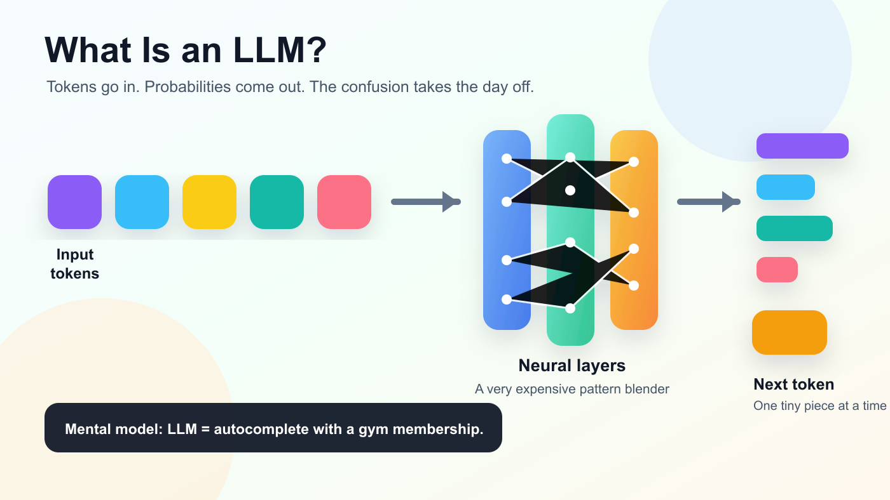
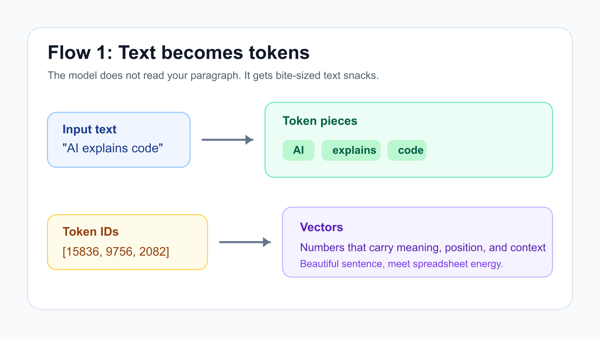
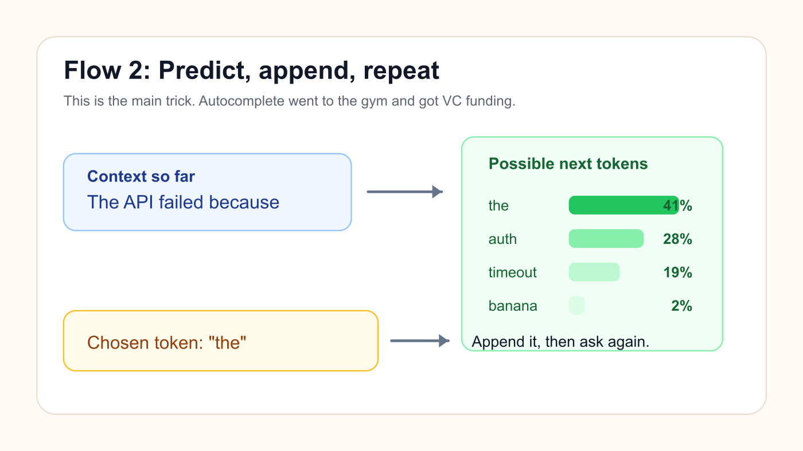
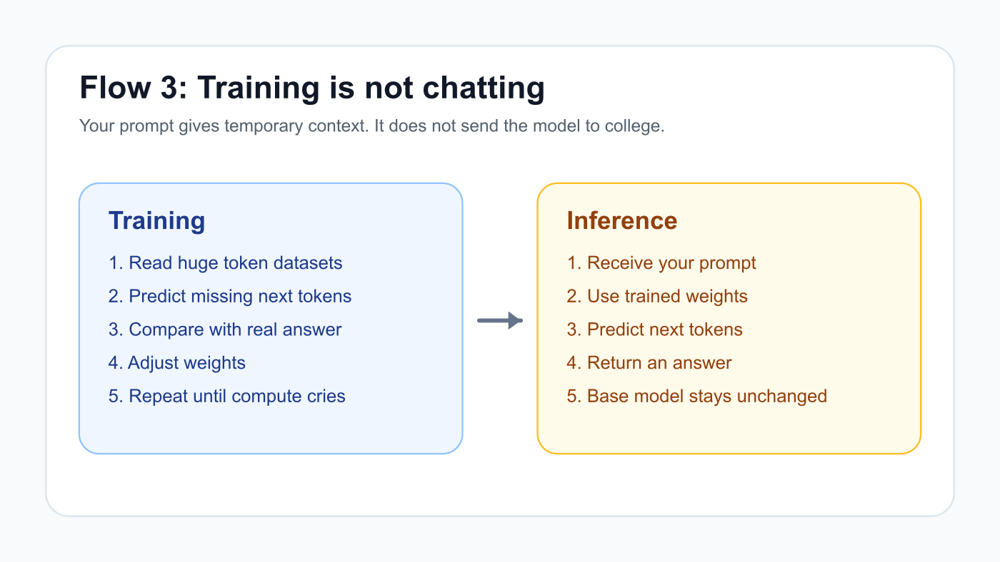
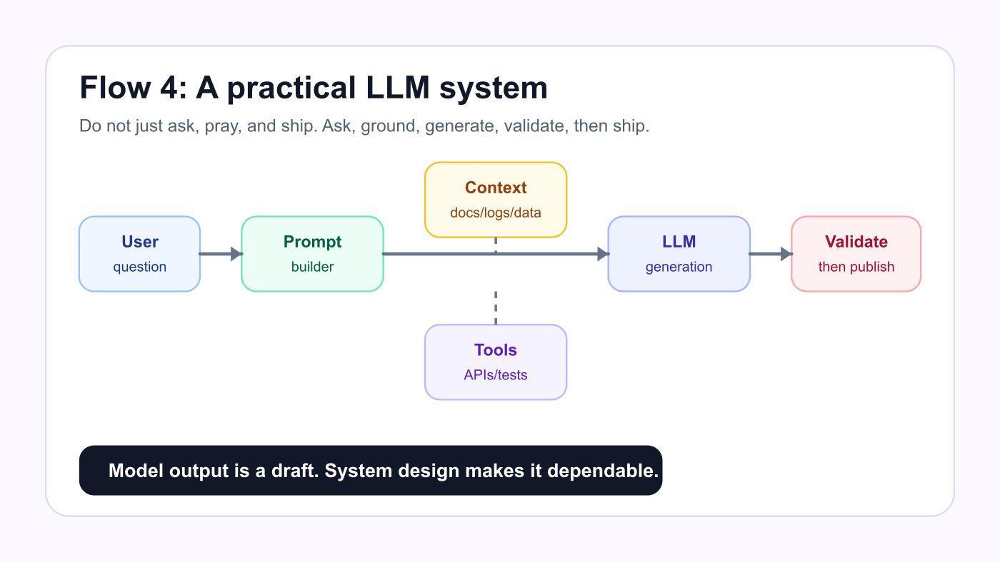

# What Is an LLM? The Clearest Explanation for Builders



Welcome to Day 1 of **90 Days of AI**.

We are starting with the question everyone hears, everyone repeats, and many people secretly pretend they understood during meetings:

> What exactly is an LLM?

An LLM, or **large language model**, is a model trained to predict the next token in a sequence of text.

That sounds too small for something that can write code, summarize PDFs, explain bugs, draft emails, generate SQL, and occasionally speak with the confidence of a motivational speaker who just discovered Kubernetes.

But the simple explanation is the right starting point:

> An LLM is a next-token prediction machine that has learned enough patterns from text and code to become a flexible language interface.

It is not magic.

It is not a database.

It is not a tiny professor living inside a GPU, wearing spectacles, waiting for your prompt.

It is a statistical model that turns **context** into **probable continuations**.

Once that clicks, the whole thing becomes less mysterious and much more useful.

## The one-line mental model

If you remember only one thing, remember this:

```text
LLM = tokenizer + neural network + decoder + context
```

The tokenizer turns text into tokens.

The neural network predicts what token could come next.

The decoder chooses tokens from those probabilities.

The context is everything the model can currently see.

That is the basic machine. The rest is scale, engineering, product design, and a cloud bill that looks like it started lifting weights.

## Why should builders care?

Because LLMs are not just chatbots.

They are becoming programmable building blocks.

You can give an LLM:

- a stack trace,
- a log file,
- a code snippet,
- an API response,
- a business requirement,
- a PDF,
- a database schema,
- or a messy meeting note that clearly needs emotional support,

and ask it to produce something useful.

That output might be:

- code,
- JSON,
- SQL,
- tests,
- documentation,
- summaries,
- classifications,
- explanations,
- plans,
- or clean structured data.

The practical question is not:

> Is the model truly intelligent?

The practical question is:

> Given the right context and guardrails, can it produce useful output reliably enough for this workflow?

That is the builder mindset. Less philosophy debate, more shipping responsibly.

## Flow 1: Text becomes tokens

Before the model can process your prompt, the text gets split into tokens.



A token is a piece of text. It might be:

- a full word,
- part of a word,
- punctuation,
- whitespace,
- or another text fragment.

For example:

```text
AI explains code
```

might become:

```text
["AI", " explains", " code"]
```

The exact split depends on the tokenizer. Different models can split the same sentence differently.

The important idea:

> The model does not directly read paragraphs. It reads token IDs.

Those token IDs are converted into vectors, which are lists of numbers the model can process.

Yes, your beautiful sentence eventually becomes math. This is software. We do this to everything.

## Tiny tokenizer demo

This is not a production tokenizer, but it makes the idea visible:

```python
#!/usr/bin/env python3
import re

TOKEN_RE = re.compile(r"\w+|[^\w\s]")

def tokenize(text: str) -> list[str]:
    return TOKEN_RE.findall(text)

text = "LLMs don't read like humans; they read tokens."

for index, token in enumerate(tokenize(text)):
    print(f"{index:02d}: {token!r}")
```

Expected output:

```text
00: 'LLMs'
01: 'don'
02: "'"
03: 't'
04: 'read'
05: 'like'
06: 'humans'
07: ';'
08: 'they'
09: 'read'
10: 'tokens'
11: '.'
```

Run it:

```bash
python3 examples/tokenizer_demo.py
```

Real tokenizers are smarter than this toy script, but the concept is the same: text becomes tokens before the model sees it.

## Flow 2: The model predicts the next token

The model's core job is to predict what token should come next.



Suppose the prompt is:

```text
The API failed because
```

The model might assign probabilities like this:

```text
the       41%
auth      28%
timeout   19%
banana     2%
```

Hopefully it does not choose `banana`, unless your backend is having a truly historic afternoon.

The decoder picks one token, appends it, and asks the model again:

```text
The API failed because the
```

Then the model predicts the next token.

Then the next.

Then the next.

That loop creates the final answer one token at a time.

This is why people call LLMs "fancy autocomplete." That phrase is both rude and annoyingly helpful.

## Tiny next-token predictor

This script is not an LLM. It is a tiny bigram model.

It only learns which token usually follows another token. Think of it as a toy bicycle parked next to a Formula 1 car. Same direction, very different insurance premium.

```python
from collections import Counter, defaultdict
import re

TOKEN_RE = re.compile(r"\w+|[^\w\s]")

def tokenize(text: str) -> list[str]:
    return TOKEN_RE.findall(text.lower())

def train(corpus: str) -> dict[str, Counter[str]]:
    tokens = ["<start>"] + tokenize(corpus) + ["<end>"]
    transitions = defaultdict(Counter)

    for current_token, next_token in zip(tokens, tokens[1:]):
        transitions[current_token][next_token] += 1

    return transitions

def distribution(model, token: str):
    counts = model.get(token.lower(), Counter())
    total = sum(counts.values())
    return sorted(
        ((next_token, count / total) for next_token, count in counts.items()),
        key=lambda item: item[1],
        reverse=True,
    )
```

Example output from the included full script:

```text
Distribution after 'llms':
   predict  25%
       use  25%
     avoid  25%
        to  25%
```

Run it:

```bash
python3 examples/mini_next_token_predictor.py
```

Real LLMs do much more than look at one previous token. They use attention mechanisms to consider many tokens in the current context.

But the toy version reveals the soul of the system:

> Learn patterns. Estimate likely continuations. Generate one token at a time.

## Flow 3: Training is different from inference

People often mix up training and inference.



Training is when the model learns.

Inference is when the trained model generates an answer.

### Training

During training:

1. The model sees huge amounts of tokenized text.
2. It predicts missing or next tokens.
3. The prediction is compared to the real token.
4. The model weights are adjusted.
5. The process repeats at massive scale.

This is expensive. Not "bought too many SaaS subscriptions" expensive. More like "the data center now has opinions about electricity" expensive.

### Inference

During inference:

1. You send a prompt.
2. The trained model processes the context.
3. It predicts next tokens.
4. It returns an answer.
5. The base model weights do not change.

So when you paste your coding style into a prompt, the model may imitate it in that conversation.

That is context.

It is not training.

Fine-tuning is different. Fine-tuning means continuing training on specific examples so the model changes behavior more persistently.

## What does "large" mean?

"Large" can refer to:

- many parameters,
- lots of training data,
- high training compute,
- large context windows,
- or some combination of these.

A parameter is a learned number inside the model.

If you are a software engineer, think of parameters as compressed learned behavior.

Nobody wrote:

```python
if user_asks_about_sql:
    mention_indexes()
```

That codebase would be larger than the moon and still somehow fail on time zones.

Instead, the model learns patterns from examples.

## What is context?

Context is the information the model can currently see.

It can include:

- system instructions,
- your prompt,
- previous messages,
- pasted code,
- retrieved documents,
- tool outputs,
- and generated text so far.

The context window is the maximum amount of text the model can handle at once.

Here is the builder lesson:

> The model can only use what is in its context or what is already encoded in its weights.

If the relevant source file is missing, the model may invent a function name with the confidence of someone explaining crypto at a wedding.

## Why can LLMs write code?

Code is structured language.

Training data often includes:

- source code,
- documentation,
- tutorials,
- issue discussions,
- API examples,
- tests,
- config files,
- and stack traces.

From that, the model learns patterns:

- how functions are named,
- how APIs are called,
- how SQL queries are shaped,
- how React components look,
- how errors are explained,
- and how tests often assert behavior.

This does not mean it understands your production system like the senior engineer who has been paged at 3 AM.

It means it can generate useful code-shaped text.

Useful? Yes.

Trust blindly? Please do not. That is how Friday deployments become folklore.

## Why do LLMs hallucinate?

Hallucination means the model generates something that sounds plausible but is false, unsupported, or invented.

This happens because the model is optimized to generate likely text, not guaranteed truth.

If the prompt suggests a package might have a method like this:

```python
client.sync_everything_now_please()
```

the model may confidently use it, even if the actual SDK has never met that method in its life.

Common causes:

- missing context,
- outdated information,
- vague prompts,
- no tool access,
- no validation,
- or asking for facts the model does not actually have.

The solution is not panic. It is workflow design.

Use:

- retrieval,
- citations,
- tests,
- type checks,
- linters,
- tool calls,
- human review,
- and smaller tasks.

Confidence is not correctness. It is just correctness wearing sunglasses.

## Flow 4: Practical LLM systems wrap the model

A real LLM app should not be:

```text
user prompt -> model -> hope
```

That is not architecture. That is a campfire story.

A practical system looks more like this:



The pieces:

- **User input:** What the person asks.
- **Prompt builder:** Converts intent into clear instructions.
- **Context:** Adds relevant docs, logs, examples, or data.
- **Tools:** Lets the model check reality through APIs, tests, search, or code execution.
- **LLM generation:** Produces the draft answer.
- **Validation:** Checks format, facts, safety, code, or business rules.

The model is powerful.

The workflow makes it dependable.

## A practical prompt template

Use this structure when asking an LLM for help:

```text
You are helping with a software engineering task.

Goal:
<what we need>

Context:
<relevant code, logs, docs, or data>

Constraints:
- Follow existing style.
- Do not invent APIs.
- Ask if required information is missing.
- Return only the requested format.

Output format:
<Markdown, JSON, SQL, patch plan, etc.>
```

This works because it gives the model:

- a role,
- a goal,
- useful context,
- boundaries,
- and a clear output shape.

It is not magic. It is just good input hygiene. Like washing vegetables, but for prompts.

## Example: weak prompt vs better prompt

Weak prompt:

```text
Write auth middleware.
```

Better prompt:

```text
Implement Express.js auth middleware.

Requirements:
- Read the bearer token from the Authorization header.
- Verify the token using the existing verifyToken function.
- Attach the decoded user to req.user.
- Return 401 for missing or invalid tokens.
- Do not change existing route handlers.
- Include Jest tests for success, missing token, and invalid token.

Existing helper:
<paste verifyToken code>

Output:
- middleware code
- tests
- short explanation
```

The second prompt gives the model the furniture. The first prompt just says "build a house" and walks away.

## Where LLMs are genuinely useful

LLMs are strong at language-shaped work:

- summarizing,
- rewriting,
- explaining,
- drafting,
- classifying,
- extracting,
- converting formats,
- generating examples,
- reviewing code,
- producing tests,
- and turning messy text into structured text.

They shine when paired with feedback:

```text
generate -> check -> fix -> repeat
```

That loop is where the productivity lives.

## Where LLMs are risky

Be careful with:

- legal advice,
- medical advice,
- financial advice,
- security-sensitive code,
- exact facts,
- live production actions,
- private data,
- complex math,
- and anything that can ruin someone's day.

The model can help.

It should not always be the final authority.

Use tools. Use tests. Use reviews. Use humans.

The model is a brilliant assistant with infinite energy and no embarrassment. Give it a checklist.

## Final takeaway

An LLM is a large model trained to predict the next token.

It turns text into tokens, processes them as vectors, predicts token probabilities, and generates output one token at a time.

Training changes the model.

Inference uses the trained model.

Context controls what the model can use right now.

Good workflows wrap the model with retrieval, tools, validation, and human judgment.

The practical formula is:

```text
clear context + good constraints + useful tools + validation = useful AI system
```

That is Day 1.

No research helmet required.

Tomorrow: **Generative AI vs Traditional AI: Same Family, Different Superpowers**.
