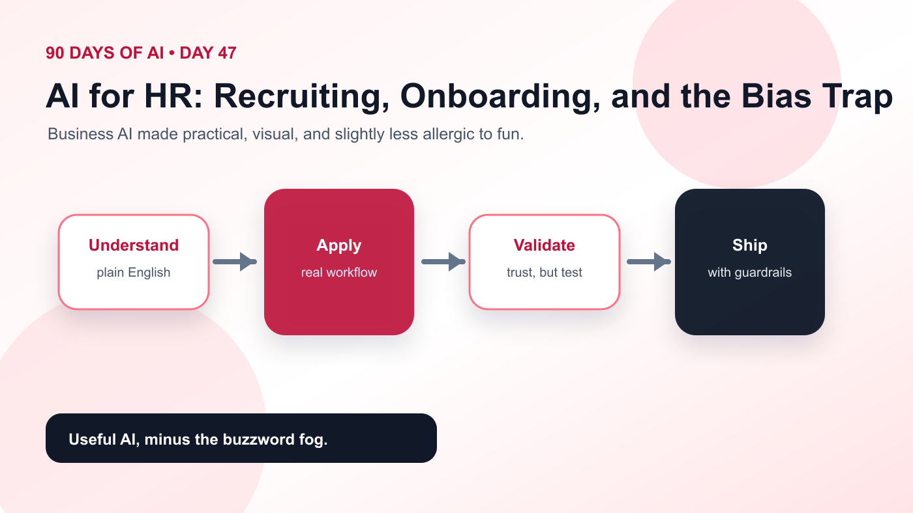
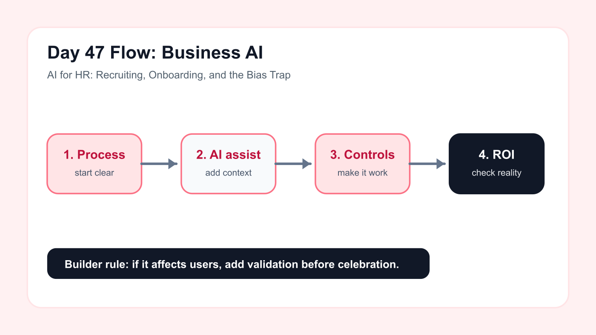

# AI for HR: Recruiting, Onboarding, and the Bias Trap



Welcome to **Day 47 of 90 Days of AI**.

Today we are tackling **AI for HR: Recruiting, Onboarding, and the Bias Trap**.

The mission is simple: understand the idea, see where it is useful, avoid the shiny-demo trap, and leave with something practical you can try.

No lab coat required. No buzzword fog machine. Just the useful stuff.

## The 30-second version

Discuss resume screening, employee support, onboarding copilots, fairness, and auditability.

Here is the plain-English version:

> AI for HR: Recruiting, Onboarding, and the Bias Trap is worth learning because it changes how people build, automate, create, decide, or work with AI systems.

The trick is not memorizing vocabulary. The trick is knowing:

- what problem it solves,
- what input it needs,
- what output it produces,
- where it fails,
- and how to verify the result before trusting it.

That last part matters. AI confidence can look very polished while being completely wrong. Basically, a PowerPoint slide with better posture.

## Why this topic matters now

Business AI works best when it improves a real workflow instead of floating around as a shiny demo.

AI is moving from **chat window** to **workflow layer**.

That means the interesting question is no longer:

> Can AI answer this?

The better question is:

> Can AI help complete this workflow safely, repeatably, and with less human busywork?

For **Business AI**, this matters because the winners will not be the people who use the fanciest tool once. The winners will be the people who turn the idea into a repeatable system.

## The core mental model



Use this four-step frame:

1. **Process** - understand the job before asking AI to do anything.
2. **AI assist** - give the model the right context or source material.
3. **Controls** - let AI generate, transform, search, plan, or assist.
4. **ROI** - validate before the output touches anything important.

That final step is where many AI demos go to become cautionary tales.

## A noob-friendly explanation

Imagine you hired a very fast assistant.

This assistant has read a shocking amount of text, knows many patterns, and can produce a useful first draft quickly.

But the assistant has three quirks:

- it may not know your exact situation,
- it may sound confident even when uncertain,
- and it needs clear instructions or it starts improvising like a meeting with no agenda.

So your job is not to worship the assistant.

Your job is to manage the workflow.

For this topic, that means:

- define the task,
- provide the right context,
- ask for a specific output,
- check the result,
- and improve the loop.

That is practical AI. Less sparkle, more systems thinking.

## Where this shows up in real life

Use it to understand what AI can actually do, where it fails, and how to design better workflows around it.

Common places you will see this:

- internal productivity tools,
- developer workflows,
- customer support,
- content creation,
- research and analysis,
- business operations,
- education and training,
- and automation pipelines.

The pattern is usually the same:

```text
messy input -> AI assistance -> structured output -> validation -> human or system action
```

If you remember that pattern, half the AI landscape becomes easier to understand.

## Practical example

Here is a small hands-on example related to this topic:

```text
Mini lab:
1. Pick one workflow related to "AI for HR: Recruiting, Onboarding, and the Bias Trap".
2. Write the current manual steps.
3. Mark which steps need judgment and which are repetitive.
4. Let AI draft only the repetitive parts.
5. Add a human review checkpoint before anything important happens.
```

This example is intentionally simple.

Simple examples are underrated. They let you understand the moving parts before the enterprise architecture arrives wearing a blazer.

## A better prompt to use

Try this prompt pattern:

```text
You are helping me understand and apply: AI for HR: Recruiting, Onboarding, and the Bias Trap

Goal:
Explain the topic in beginner-friendly language and show how to use it in a practical workflow.

Context:
Audience: beginners and builders
Use case: <describe your real workflow here>

Constraints:
- Use simple language.
- Give one practical example.
- Mention common mistakes.
- Include a validation checklist.
- Do not overhype the topic.

Output:
Markdown with headings, bullet points, and one example.
```

This works because it gives the model a job, context, constraints, and a format.

Without that, you may get a dramatic essay that sounds useful until you try to implement it.

## Common mistakes

Watch out for these:

- **Mistaking a demo for a system.** A demo can impress people. A system survives Monday morning.
- **Skipping validation.** AI output should be checked, especially if it affects users, money, security, health, or reputation.
- **Using vague prompts.** Vague input creates vague output with confident eyebrows.
- **Ignoring data quality.** If the input is messy, the output may become professionally formatted nonsense.
- **Automating too much too soon.** Start with assistive workflows before handing over the steering wheel.

The goal is not to avoid AI.

The goal is to use it like a builder instead of a gambler with Wi-Fi.

## Quick checklist

Before using this in a real workflow, ask:

- What exact task should AI help with?
- What context does it need?
- What should the output look like?
- How will we verify the output?
- What can go wrong?
- Who approves the final result?
- What data should not be sent to the model?
- What metric tells us this is actually useful?

If you can answer those questions, you are not just using AI.

You are designing an AI workflow.

## Keywords to remember

AI HR, AI recruiting, HR automation, AI bias

Do not memorize these like exam flashcards.

Use them as search handles. When you see these terms in tools, docs, or product announcements, you will know what mental bucket they belong to.

## Final takeaway

The big idea behind **AI for HR: Recruiting, Onboarding, and the Bias Trap** is not hype.

It is leverage.

AI becomes useful when you connect it to a real workflow, give it the right context, and validate the result before trusting it.

Use this formula:

```text
clear task + useful context + AI assistance + validation = practical value
```

That is the difference between a toy demo and something people come back to every day.

And that is how beginners become dangerous in the good way: not by knowing every model name, but by understanding the patterns underneath.

Tomorrow: **AI in Finance Teams: Forecasts, Reconciliation, and Very Serious Spreadsheets**.
